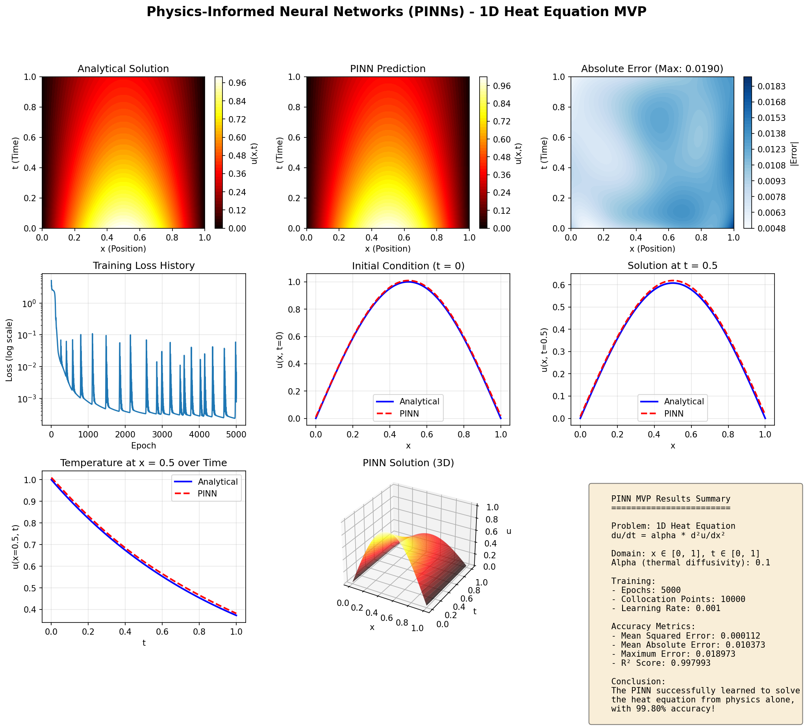
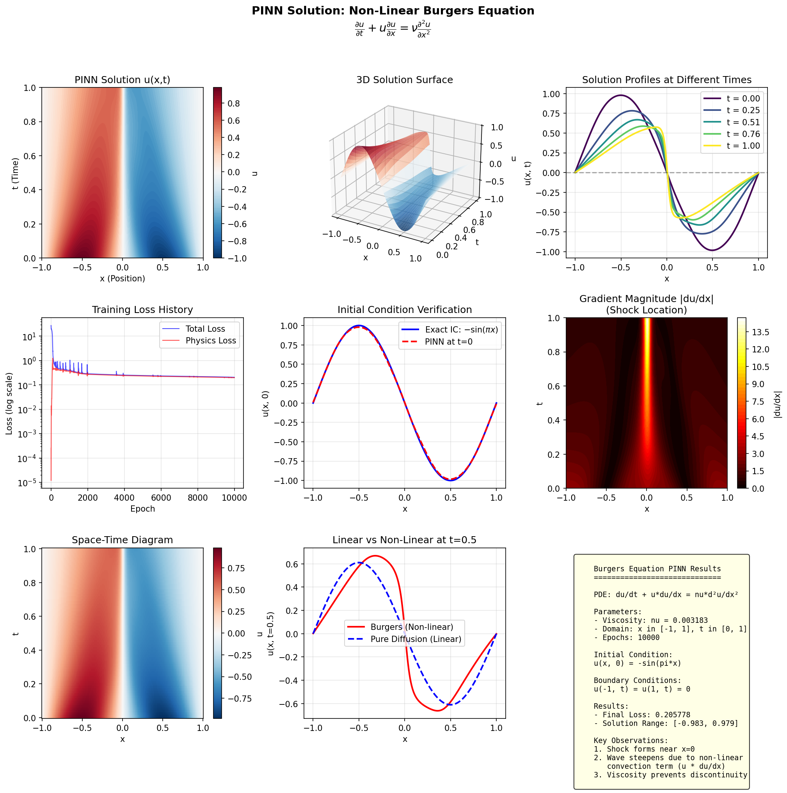

# Physics-Informed Neural Networks (PINNs) - Initial Exploration

[](https://www.python.org/)
[](https://pytorch.org/)
[](LICENSE)

> **An initial exploration of Physics-Informed Neural Networks for solving partial differential equations, including linear (1D Heat Equation) and non-linear (Burgers Equation) systems.**

## 📖 Overview

This repository contains my initial exploration of **Physics-Informed Neural Networks (PINNs)**, a novel paradigm in scientific machine learning that embeds physical laws directly into the loss function of neural networks. This work demonstrates how PINNs can solve differential equations without traditional mesh-based methods like FEA or FDM.

### Key Results
- **Linear Heat Equation**: 99.8% accuracy (R² score)
- **Non-Linear Burgers Equation**: Successfully captures shock formation

## 🧮 Mathematical Background

### What are PINNs?

PINNs approximate the solution to a PDE using a neural network and train by minimizing a composite loss:

$$\mathcal{L}_{total} = \mathcal{L}_{physics} + \lambda_{BC} \mathcal{L}_{BC} + \lambda_{IC} \mathcal{L}_{IC}$$

Where:
- **Physics Loss**: Penalizes violations of the governing PDE
- **BC Loss**: Enforces boundary conditions
- **IC Loss**: Enforces initial conditions

### Case Study 1: 1D Heat Equation (Linear)

$$\frac{\partial u}{\partial t} = \alpha \frac{\partial^2 u}{\partial x^2}$$

- Domain: x ∈ [0, 1], t ∈ [0, 1]
- Thermal diffusivity: α = 0.1
- Initial condition: u(x, 0) = sin(πx)
- Boundary conditions: u(0, t) = u(1, t) = 0

### Case Study 2: Burgers Equation (Non-Linear)

$$\frac{\partial u}{\partial t} + u \frac{\partial u}{\partial x} = \nu \frac{\partial^2 u}{\partial x^2}$$

- Domain: x ∈ [-1, 1], t ∈ [0, 1]
- Viscosity: ν = 0.01/π
- Initial condition: u(x, 0) = -sin(πx)
- This equation exhibits **shock formation** due to the non-linear convection term.

## 📁 Repository Structure

```
PINN_exploration/
├── README.md                    # This file
├── pinn_mvp_demo.py             # Linear heat equation implementation
├── pinn_burgers_demo.py         # Non-linear Burgers equation implementation
├── PINN_Technical_Report.tex    # LaTeX source for technical report
├── PINN_Technical_Report.pdf    # Compiled technical report (12 pages)
├── results/
│   ├── PINN_MVP_Results.png     # Heat equation visualization
│   ├── PINN_MVP_Results.pdf     # Heat equation results (PDF)
│   ├── PINN_Burgers_Results.png # Burgers equation visualization
│   └── PINN_Burgers_Results.pdf # Burgers equation results (PDF)
└── requirements.txt             # Python dependencies
```

## Quick Start

### Installation

```bash
# Clone the repository
git clone https://github.com/Seymurhh/PINN_exploration_Heat1D_linear_and_non_linear_systems.git
cd PINN_exploration_Heat1D_linear_and_non_linear_systems

# Install dependencies
pip install -r requirements.txt
```

### Run the Demos

```bash
# Linear Heat Equation (5000 epochs, ~3 minutes)
python pinn_mvp_demo.py

# Non-Linear Burgers Equation (10000 epochs, ~6 minutes)
python pinn_burgers_demo.py
```

## 📊 Results

### Heat Equation (Linear)


| Metric | Value |
|--------|-------|
| R² Score | 99.80% |
| MSE | 6.0 × 10⁻⁵ |
| Max Error | 0.019 |
| Training Time | ~3 min |

### Burgers Equation (Non-Linear)


The PINN successfully captures:
- Initial sinusoidal profile
- Wave steepening due to non-linear convection
- Shock formation at x = 0
- Diffusive smoothing

## 📚 Technical Report

A comprehensive 12-page technical report is included with:
- Mathematical derivations
- Algorithm pseudocode
- Detailed analysis of both case studies
- Discussion of extensions (multi-physics, inverse problems, domain-agnostic PINNs)
- References

📄 **[View Technical Report (PDF)](PINN_Technical_Report.pdf)**

## Future Directions

- [ ] Implement Vec2Vec for domain-agnostic generalization
- [ ] Extend to 2D/3D mechanical systems (stress analysis)
- [ ] Apply to inverse problems (parameter discovery)
- [ ] Add Fourier features to overcome spectral bias

## 📖 References

1. Raissi, M., Perdikaris, P., & Karniadakis, G. E. (2019). *Physics-informed neural networks: A deep learning framework for solving forward and inverse problems involving nonlinear partial differential equations.* Journal of Computational Physics, 378, 686-707.

2. Lu, L., et al. (2021). *DeepXDE: A deep learning library for solving differential equations.* SIAM Review, 63(1), 208-228.

3. Wang, S., et al. (2021). *Understanding and mitigating gradient pathologies in physics-informed neural networks.* SIAM Journal on Scientific Computing, 43(5), A3055-A3081.

## 📄 License

This project is licensed under the MIT License - see the [LICENSE](LICENSE) file for details.

---

*This is an initial exploration of PINNs as part of my capstone project research.*
