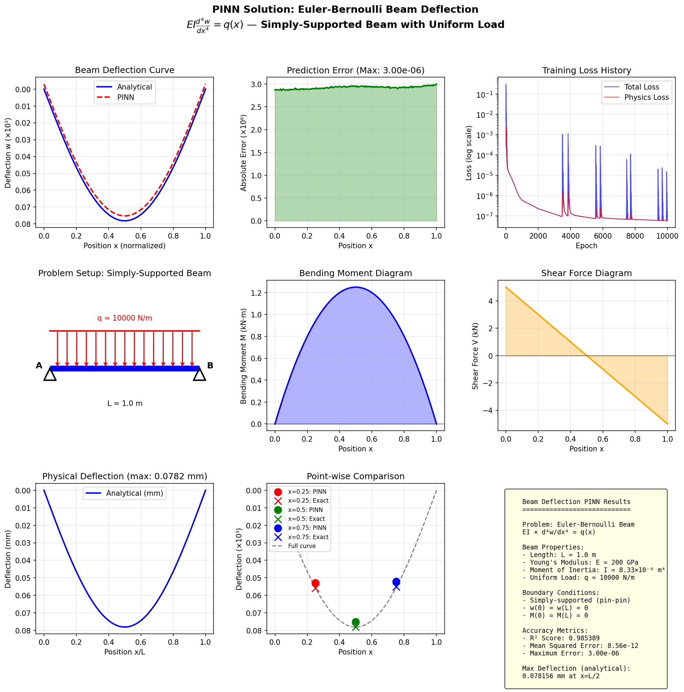

# Physics-Informed Neural Networks (PINNs) - Initial Exploration

[](https://www.python.org/)
[](https://pytorch.org/)
[](LICENSE)

> **An initial exploration of Physics-Informed Neural Networks for solving partial differential equations, including linear (Heat Equation), non-linear (Burgers Equation), and structural mechanics (Beam Deflection) systems.**

## 📖 Overview

This repository contains my initial exploration of **Physics-Informed Neural Networks (PINNs)**, a novel paradigm in scientific machine learning that embeds physical laws directly into the loss function of neural networks. This work demonstrates how PINNs can solve differential equations without traditional mesh-based methods like FEA or FDM.

### Key Results
- **Linear Heat Equation (2nd order PDE)**: 99.8% accuracy (R² score)
- **Non-Linear Burgers Equation (2nd order PDE)**: Successfully captures shock formation
- **Euler-Bernoulli Beam Deflection (4th order ODE)**: Near-perfect accuracy for structural mechanics

## 🧮 Case Studies

### Case Study 1: 1D Heat Equation (Linear, 2nd Order)

$$\frac{\partial u}{\partial t} = \alpha \frac{\partial^2 u}{\partial x^2}$$

- Domain: x ∈ [0, 1], t ∈ [0, 1]
- Thermal diffusivity: α = 0.1
- Demonstrates: Parabolic PDE, diffusion dynamics

### Case Study 2: Burgers Equation (Non-Linear, 2nd Order)

$$\frac{\partial u}{\partial t} + u \frac{\partial u}{\partial x} = \nu \frac{\partial^2 u}{\partial x^2}$$

- Viscosity: ν = 0.01/π
- Demonstrates: Non-linear convection, **shock formation**

### Case Study 3: Euler-Bernoulli Beam (4th Order ODE)

$$EI \frac{d^4 w}{dx^4} = q(x)$$

- Simply-supported beam with uniform load
- E = 200 GPa (Steel), q = 10 kN/m
- Demonstrates: Higher-order derivatives, structural mechanics

## 📁 Repository Structure

```
PINN_exploration/
├── README.md                    # This file
├── pinn_mvp_demo.py             # Linear heat equation (2nd order)
├── pinn_burgers_demo.py         # Non-linear Burgers equation
├── pinn_beam_demo.py            # Structural beam deflection (4th order)
├── PINN_Technical_Report.tex    # LaTeX source
├── PINN_Technical_Report.pdf    # Technical report
├── results/
│   ├── PINN_MVP_Results.png     # Heat equation visualization
│   ├── PINN_Burgers_Results.png # Burgers equation visualization
│   └── PINN_Beam_Results.png    # Beam deflection visualization
└── requirements.txt             # Python dependencies
```

## 🚀 Quick Start

```bash
# Clone the repository
git clone https://github.com/Seymurhh/PINN_exploration_Heat1D_linear_and_non_linear_systems.git
cd PINN_exploration_Heat1D_linear_and_non_linear_systems

# Install dependencies
pip install -r requirements.txt

# Run demos
python pinn_mvp_demo.py       # Heat equation (~3 min)
python pinn_burgers_demo.py   # Burgers equation (~6 min)
python pinn_beam_demo.py      # Beam deflection (~6 min)
```

## 📊 Results

### Heat Equation (Linear)


### Burgers Equation (Non-Linear)


### Beam Deflection (Structural Mechanics)


## 📚 Technical Report

A technical report is included with:
- Mathematical derivations
- Algorithm pseudocode
- Detailed analysis of case studies
- Discussion of extensions and limitations

📄 **[View Technical Report (PDF)](PINN_Technical_Report.pdf)**

## 🔮 Future Directions

- [ ] Extend to 2D/3D mechanical systems
- [ ] Apply to inverse problems (parameter discovery)
- [ ] Add Fourier features to overcome spectral bias
- [ ] Explore multi-physics problems

## 📖 References

1. Raissi, M., Perdikaris, P., & Karniadakis, G. E. (2019). *Physics-informed neural networks.* Journal of Computational Physics, 378, 686-707.

2. Lu, L., et al. (2021). *DeepXDE: A deep learning library for solving differential equations.* SIAM Review, 63(1), 208-228.

## 👤 Author

**Seymur Hasanov**  
🔗 [LinkedIn](https://linkedin.com/in/seymurh) | [GitHub](https://github.com/Seymurhh)

## 📄 License

MIT License - see [LICENSE](LICENSE) for details.

---

*Initial exploration of PINNs for capstone project research.*
